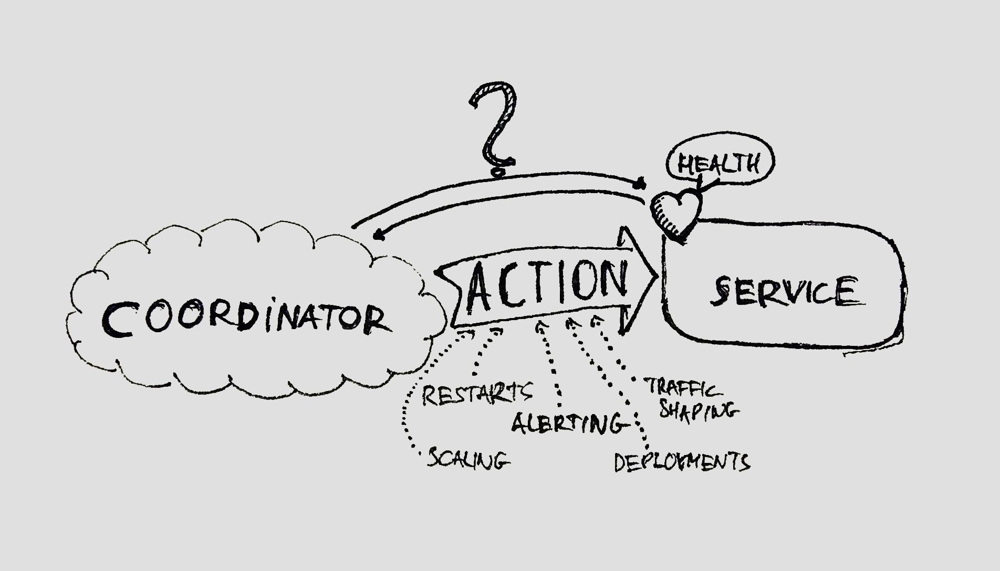
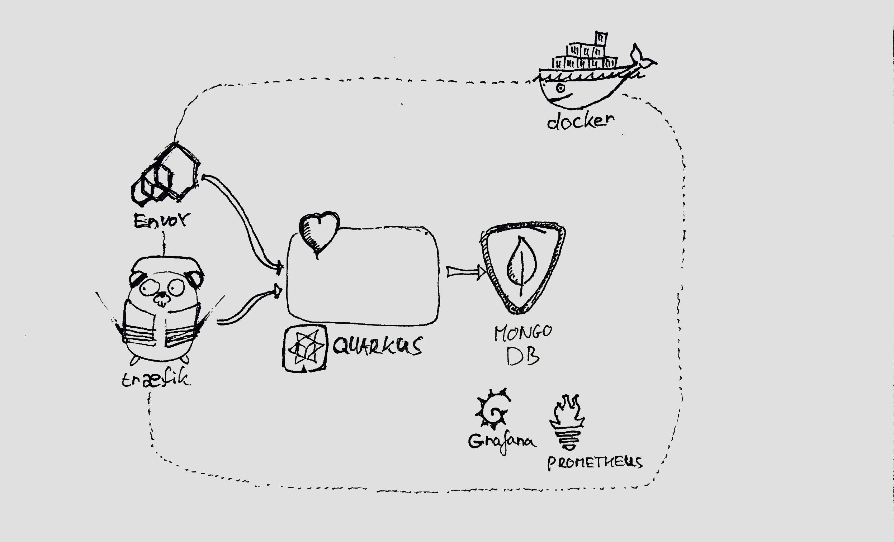
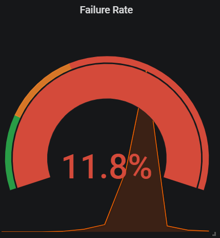
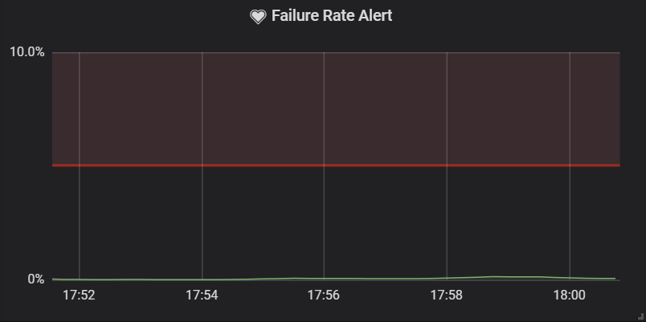
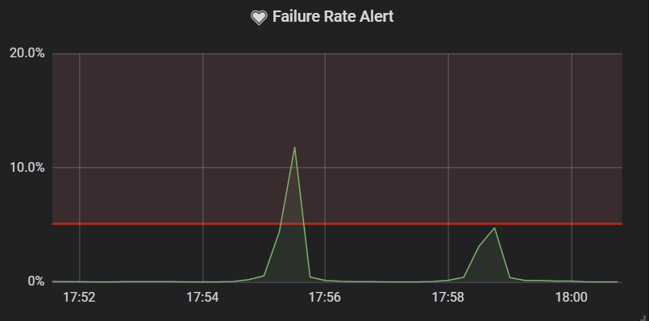
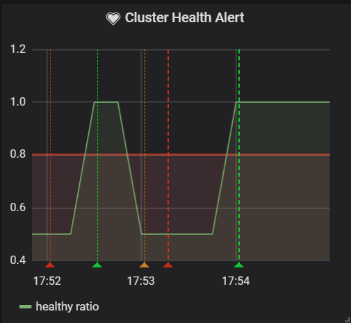
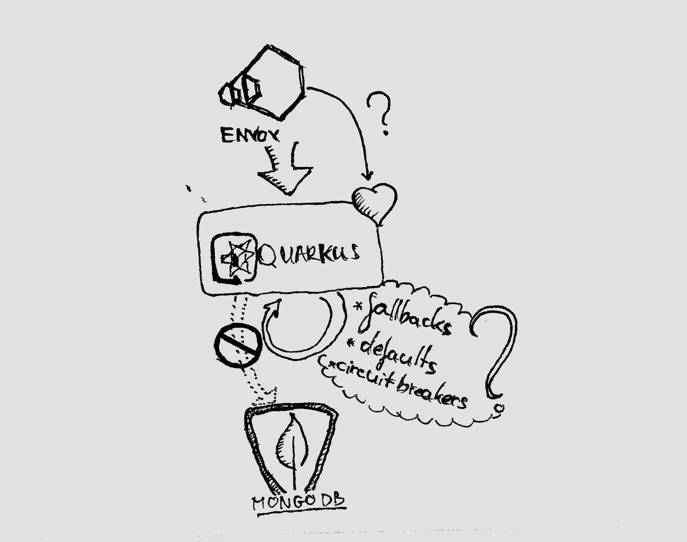
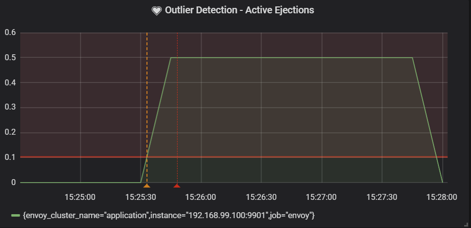

# An overview of health check patterns

Many developers have some existing health check mechanism implemented. Especially nowadays in the "microservices era" of backend development. I really hope that you also do. Whenever you have something simple that just throws an HTTP 200 back at the caller or more complex logic, it's good to be aware of the pros & cons of different health check implementations. In this article, I'm going to go through each type of health check and investigate what kind of issues can be resolved with each of them.

# Why do we need health checks at all?

Good question! Especially we have to consider how far I can get away with postponing the implementation. The reasons for not having health checks can be various, like tight project deadlines, corporate politics or complex configurations of vendor specific hardware (I won't judge you). But you have to know, that just because your code seem static it doesn't mean that it's behaving the same way when running for a longer period. You're depending on a computer hardware, 3rd party libraries, dependencies manintaned by other teams and none of them are providing 100% guarantees. As a rule of thumb you can't build 100% reliable software on top of unreliable components. Your service is going to fail shortly after your first release to production. And if it does, you have to detect it somehow. We all agree that it's better to do it before end-users do.

## Types of failures
The typical failures in a running Java application are the following:

### Bugs
Caused by every developer just by the nature of coding. In average this is a [few bugs per 1000 lines of code][code-complete-bugs].

### Memory leaks
Memory leaks occur when the garbage collector fails to recycle a specific area of the heap and this area gradually grows over time. The JVM process will just exit if it runs out of memory, but until that it causes an increased number of GC pauses and lower performance over time. 

### Thread leaks
If you don't close your resources or don't manage your own threads properly, thread leaks can occur. This will suddenly lead your JVM to a complete stall while the CPU is going to spin at 100%.

### Configuiration issues
Configuration issues are scary because they can be caught in the same environment they're referring to. This means that you'll face a production-related configuration issue during production deployment and vice-versa. It doesn't matter if you have nice test coverage and all kinds-of integration and performance tests in place. A misconfiguration can just simply destroy your attempt of rolling out a new release.

### Deadlocks
The JVMs I've used does not offer deadlock detection. This means, that threads hanging in deadlock will just wait forever until the JVM exits. 

### Connection pool misconfigurations
If you don't review all your connection pool settings, you're risking that a connection pool will start causing failures. The consequences can be various, but usually end up as one of the failures listed above.

## Redundancy

The simplest way to introduce fault-tolerance into any system is by introducing redundancy. You can make your data redundant by copying them over several times and hiding "bad bytes" as a RAID configuration does with multiple hard drives. Similarly, you can also make a database time redundant, by holding and serving multiple versions of the same record. For services what works best is making the process redundant. Keeping multiple processes running at the same time, so if one of them misbehaves others can take over the workload. Of course, this only works if you have some kind-of coordination in place. Usually, this is done by using health checks.

# Anatomy of a helath check

The coordination I was talking above can be done by a container orchestrator or a load balancer for example. The role of these coordinators is to hide implementation details from the clients using your cluster of services and show them as a single logical unit. In order to do this, they have to schedule workload to only those services, which are reported to be healthy. They ask each of the running process in the cluster about their health and take an action based on the response. These actions can be various. Some of them are

- Restarts
- Alerting
- Traffic shaping
- Scaling
- Deployments



# Various health check implementations

You can implement health checks in many-many ways and I'm going to show you an example on each. Then we're investigating the typical type of failures they are capable to indicate and their effectiveness.

## About the examples
You can find a sandbox with predefined health check implementations at https://github.com/gitaroktato/healthcheck-patterns. I'm going to use Envoy, Traefik, Prometheus, Grafana, Quarkus and minikube for represeinting the various pattners.



# No health checks
No health checks? No problem! At least your implementation is not misleading. But can we configure at least someting useful for these services as well?

## Restarts
The good news is that you can still rely on your container orchestrator if you've configured your container properly. Kubernetes restarts processes if they stop, but it will happen only if your crashed process is also causing its container to exit. In the deployments you can define the number of [desired replicas][kube-desired-replicas] and the orchestrator will automatically start new containers if needed. This mechanism works without any [liveness/readiness probe][liveness-readiness-example]

## Alerts
You can still set up alerts based on the type of HTTP responses your load balancer sees if you're using L7 load balancing. Unfortunately both with Envoy and Traefik it's not possible in-case of a TCP load balancer, because of the lack of interpretation of the HTTP response codes. I used these two PromQL queries and configured an alert if the error rate for a given service got higher than a specified threshold.

```
sum(rate(envoy_cluster_upstream_rq_xx{envoy_response_code_class="5"}[$interval])) / 
sum(rate(envoy_cluster_upstream_rq_xx[$interval]))
```

```
sum(rate(traefik_entrypoint_requests_total{code=~"5.."}[$interval])) / 
sum(rate(traefik_entrypoint_requests_total[$interval]))
```


One thing that's important to mention here, is that in many cases when a dependency (e.g. the database) is not available the response rate of the service drops. This causes spikes in the queries above, which are unseen for the predefined `$interval` because of the previous higher rate of successful responses. Below you can find two samples from the same period with two different intervals. You can see that the spike is unseen if the outage of the dependent service is shorter than the predefined interval. You can use it for your advantage to avoid alerts for intermittent outages which are not worth act upon (at least not in the middle of the night).

|5 minute interval| 1 minute interval|
|-----------------|------------------|
|||

## Deployments & Traffic Shaping
I found no options to coordinate deployments and traffic shaping if you don't have a health check implementation in-place. So, you need to advance to the next level of health checks if you plan to improve these two activities.

## Detectable failures
If your container orchestrator is doing the work properly then you're able to catch memory leaks when your JVM exits with `OutOfMemoryError`. In case of a thread leak, you're not going to be so lucky: Transactions will just become slower and slower until they completely stall. You can try to put an alert on a percentile of the response times to catch if anything goes wrong, but even in this case resolution needs manual intervention. Waiting with a thread or a memory leak to eventually kill the JVM is going to take a long time and will cause a great amount of harm for your downstream and upstream calls until it finally happens. It just doesn't worth the risk at all.

# Shallow Health Checks
Shallow health checks usually just verify if the HTTP pool is capable of providing some kind of response. They do this by returning a static content or empty page with an HTTP 2xx response code. In some scenarios, it makes sense to do a bit more than that and check the amount of free disk space under the service. If it falls under a predefined threshold, the service can report itself as unhealthy. This provides some additional information in case there's a need to write to the local filesystem (because of logging), but far from being perfect: Checking free disk space is not the same as trying to write to the file system. And there's no guarantee that write will succeed. If you're out of inodes, your log rotation can still fail and can lead to unwanted consequences.

I've create my own implementation because Quarkus had no default disk health checking. This can be found [in my code over here][disk-health]. An exampele HTTP response of my disk healt check can be found below. 

```
{
    "status": "UP",
    "checks": [
        {
            "name": "disk",
            "status": "UP",
            "data": {
                "usable bytes": 82728624128
            }
        }
    ]
}
```

Spring Boot Actuator has a [default implementation][spring-boot-disk-health] that has similar functionalities. 

```
{
   "status":"UP",
   "details":{
      "diskSpace":{
         "status":"UP",
         "details":{
            "total":250790436864,
            "free":100327518208,
            "threshold":10485760
         }
      }
   }
}
```

## Restarts
In Kubernetes we have the option to configure a [liveness/readiness][liveness-readines] probe for our containers. With the help of this feature our service will be restarted automatically, in case it becomes unhealthy. This will recover some issues with the HTTP pool, like thread leaks and deadlocks and some of the more generic faults i.e. memory leaks. Note, that you won't catch any deadlock that occurs further in the stack, like at the database or integration level.

If we're concerned about I/O operations, including disk free space in our health check can result as respawning our container in another worker node which hopefully has now enough to keep our services running. 

In my sandbox here's the [liveness and readiness probe configuration][liveness-readiness-example] so you can try different scenarios by yourself.

```
...
        livenessProbe:
          httpGet:
            path: /application/health/live
            port: http
          failureThreshold: 2
          initialDelaySeconds: 3
          periodSeconds: 3
        readinessProbe:
          httpGet:
            path: /application/health/ready
            port: http
          failureThreshold: 2
          initialDelaySeconds: 3
          periodSeconds: 3
        startupProbe:
          httpGet:
            path: /application/health
            port: http
          failureThreshold: 3
          periodSeconds: 5
...
```

## Traffic shaping
The most common way of using health checks is to integrate them with load balancers, so they can route traffic to only healthy instances. But what should we do in cases, when the database is not accessible from the service's point of view? 

In this scenario they will still retrieve workload and probably fail when trying to write to the database. We have 3 different options that offer some resolution:

- Try to store the request in the service itself and retry later
- Fail fast and let the caller do the retry
- Include database in the health indicator of the service and try to reduce the number of these cases

The first opiton will lose the request if the service restarts. The second option moves the problem one layer above. The third option leads us to deep health checks.

## Alerting
The same mechanism can be applied for creating alerts as before. Additionally, you can indicate the propotion of still healthy members VS all the members in the cluster, like in the example PromQL query below:

```
envoy_cluster_health_check_healthy{envoy_cluster_name="application"} /
max_over_time(envoy_cluster_membership_total{envoy_cluster_name="application"}[1d])
```



Unfortunately, Traefik is not exposing these metrics so it's not available in every load balancer.

## Deployments
Shallow health checks don't expose the lower layers of your application, so it can't be used to catch configuration issues during deployment. But with deep health check, the case is different.

## Detectable failures
Shallow health check includes us a few additional aspects of the running process. We can verify if the HTTP pool is working properly and include some local resources, like disk space. This enalbes to catch memory and thread leaks faster. Pay attention to the timeout setting of your coordinator, who's responisble to do the corresponding action. The most valuable actions are restarts in this case, so make sure, that your container orchestrator has [good timeout settings][kube-liveness-timeout] for the livenes probes. 

# Deep health checks
Deep health check tries to include the surrounding of your application. If you're using Spring Boot, you will have many [automatically configured health indicators][spring-boot-health-indicators] availalbe with Actuator. Here's an example of how a deepp health check will look in the sandbox application:

```
{
    "status": "UP",
    "checks": [
        {
            "name": "MongoDB connection health check",
            "status": "UP",
            "data": {
                "default": "admin, config, hello, local"
            }
        }
    ]
}
```

## Restarts

It makes sense to have multiple health check endpoints for the controlling logic. Just like Kubernetes does. This can lead to applying different actions for different failures. [Liveness, readiness and startup][liveness-readines] probes are good examples. Each controls a specific aspect of the orchestration. In the sandbox implementation, by visiting the [deployment YAML][kubernetes/application.yaml] you can see that each probe is using a different endpoint.

```
...
          livenessProbe:
            httpGet:
              path: /application/health/live
              port: http
            failureThreshold: 2
            initialDelaySeconds: 3
            periodSeconds: 3
          readinessProbe:
            httpGet:
              path: /application/health/ready
              port: http
            failureThreshold: 2
            initialDelaySeconds: 3
            periodSeconds: 3
          startupProbe:
            httpGet:
              path: /application/health
              port: http
            failureThreshold: 3
            periodSeconds: 5
...
```

The startup probe includes all health check types from the application (annotated with `@Liveness` and `@Readiness` respectively). If I'm including a health check that's actively testing if the connections to my dependencies are still working, Kubernetes will ensure that the rollout of the new deployment will proceed only if the related configuration is correct. 

So, what happens if I'm introducing a bug in my configuration? As long as the startup probe is checking if the related dependency is reachable, the deployment will stall and can be rolled back with the following command (you can try this out in the sandbox implementation as well)

```
kubectl rollout undo deployment.v1.apps/application -n test
```

## Traffic shaping
Now, with deep health checks, a workload will be assigned to a service only if its dependencies proved to be accessible. For aggregates with multiple upstream dependencies, this means an all-or-nothing approach, which might be too restrictive. For services with just a database connection this only means additional pool validation.

### Connection pool issues
What should we do in the case, when database dependency becomes inaccessible? Should the service report itself as healthy or unhealthy? This can indicate at least two different problems: Either the connection pool experiencing hard times or the database has some issues. In the latter case most probably other instances will also report themselves as unhealthy and the load balancer can just go ahead and remove every instance from the fleet. In practice, they keep certain traffic still flowing through, because simply it just does not make sense to totally stop serving requests. This can avoid a possible health check related bug causing production outage. You should visit your load-balancing setting and set the upper limit of instances that can be removed.

### Deep health checks and other fault-tolerant patterns - Probing


How should I keep my circuit breaker configuration in-sync with my health check implementations? If my application offers stale data from local cache when the real one is not available, should I report the application healthy or unhealthy? I say, that these are the limitations of deep health checks which cannot be solved so easily. The most convenient way of reducing your health check false positives is by sending a synthetic request every time it's queried. If you're reading a user from the database then add a synthetic user manually and read the record every time. If you're writing to a Kafka topic, send a message with a value that will allow consumers to distinguish synthetic messages from real ones.

The drawback is that you need to filter out the synthetic traffic in your monitoring infrastructure. Also, it can produce more overhead than usual health check operations.

### Implementing probing
The only way you can mess up the implementation if the excution path of probing is different from the real one. Let's assume you're not calling through the same controller you use for busines operations and someone implements circuit breaking logic in that place. Your healt check won't pass through your circuit breaker logic.

- If your load balancer allows setting a specific payload of the health check you can call the real controller direclty.
- Otherwise you have to create the synthetic payload and forward your request to the original controller.

In my [implementation][probing-custom-health], I chose to inject the controller and just include the result without any further interpretation in the heatlh-check class. It should be as simple as possible.

If you're using Spring you can even use the [`forward:`][spring-forward] prefix to simplify the implementation even further.

Here's a sample of how it looks in my sandbox environment:

```
{
    "status": "UP",
    "checks": [
        {
            "name": "Probing health check",
            "status": "UP",
            "data": {
                "result": "{\"_id\": {\"$oid\": \"cafebabe0123456789012345\"}, \"counter\": 2}",
                "enabled": true
            }
        }
    ]
}
```

## Detectable failures
If we validate the connection pools during each health check the coordinator is going to detect connection pool misconfigurations. Because we also inspect HTTP pools as with the previous pattern, we have a good chance of still catching thread and memory leaks. The drawback of this method is that it's hard to synchronize with other fault-tolerant patterns, like fallbacks and circuit breakers. If we plan to implement any of these, we're better off with probing.

By the aid of probing it's possible to run a synthetic request through all the layer of the applications. This allows catching of every type of failure in every layer, including memory and thread leaks, pool misconfigurations, bugs, configuration issues and deadlocks. Think of it as a tiny smoke test that runs periodically.

# Passive health checking
How can we take this to the next level? Well, simply said there's no need to verify things that are already happening: Why don't we use the existing request flow to our aid and use its results to determine service health? This is the main concept of passive health checking. Unfortunately I've not found any support for these kind-of health reporting in the application frameworks I'm familiar with, so I had to craft my own. You can find the implementation in the [MeteringHealthCheck][MeteringHealthCheck] class. I'm using the same [meters][MeteringHealthCheck.incrementAndGetFailed] as in the [controller class][MongoResource] I'm wishing to inspect. When the failure rate is [higher than the configured threshold][MeteringHealthCheck.failure-threshold], I report the service as unhealthy. Down below is a sample of how the health check looks like, when it's queried.

```
{
    "status": "UP",
    "checks": [
        {
            "name": "Metering health check",
            "status": "UP",
            "data": {
                "last call since(ms)": 4434,
                "failed ratio": "0.01",
                "enabled": true
            }
        }
    ]
}
```

There are some additional things to note here. It does not make sense to remove the service forever, so it's better to include a [time limit][MeteringHealthCheck.maxEvictionSeconds] for the removal. After a while you would like to give a chance to the service again to see if the situation is getting better. 

Remember the part, where I was writing about the difference of rates bettween normal operation and in case of failures? That's why it doesn't make sense to use determine the failure rate without a specified time window. And that's the reason for using [Meters instead of Counters][MeteringHealthCheck.getFailedRatio] when determining failure rates.

And finally never-ever forget to include a [feature flag][MeteringHealthCheck.meteringHealthCheckEnabled]. This will buy you a lot of time, when having to deal with outages at the end of Friday or in the middle of the night. 

## Restarts
I think that using passive health checks for container restarts has a similar effect to deep health checks. So one implementation in your service is fair enough. If your framework offers deep health check out-of-the-box, it's OK to use it to control restarts.

## Traffic shaping
The real benefit of using this kind-of health checking is that you don't have to synchroinze the configuration with other fault-tolerant patterns, like defaults, fallbacks or circuit breakers. Even timeout configuration will not have an effect of the health checking mechanism itself, since the health endpoint won't trigger requests through your connection pool at all. It's just providing statistics.

One of the great news is that Envoy offers this functionality by default, named as [outlier detection][Envoy.outlier-detection]. It is even exposing the information through metrics, so you can build your [own alerts][Envoy.outlier-metrics] based on them. 

## Alerting
The following PromQL query was able to show the propotion of the evicted instances, when using passive health checks.

```
envoy_cluster_outlier_detection_ejections_active{envoy_cluster_name="application"} \
max_over_time(envoy_cluster_membership_total{envoy_cluster_name="application"}[1d])
```



## Deployments
For controlling deployments you need to interact with the dependent resources actively. Passive health check is not capable of doing that, so you're better off using probing or simple deep health checks. 

## Detectable failures
The provided benefits are the same as using probing. Again, the coordinator is going to detect all kind-of failures, including memory & thread leaks, connection and configuration issues, bugs, and deadlocks. And you won't need to keep the other fault-tolerant implementations in-sync with the health check mechanism.

# Summary
Health checks are just one aspect of fault tolerance. There are many other fault-tolerant patterns availalbe. I'm not even sure if they're the oldest ones, but I think they're the most known. Getting your heatlh-checks rigt bring you closer for a more resilient setup of your microservices. 

As a general rule, make sure you're actively monitoring every layer of your architecture. It will speed up your root cause analysis drastically. Imagine having a deep health check alert showing that the database is down. Having metrics on the database level and shown on the same dashboard will immediatly help you on having a better understanding on the problem.

## Maturity level
Based on my experience the maturity level of each health check type has the following order:

1. Shallow or deep health checks
1. Probing
1. Passive health checks

## Probing and passive health checks
The reason why I think that these ones are the most advanced type of implementations is that these are the only ones which offer capturing the widest variety of issues in your code.

The advantage of passive health check over probing, is that it does not require additional synthetic traffic, which can cause unnnecessary noise and complexity.

The most important advantage of probing over passive health checks, is that it is a lot easier to implement. Another advantage is that it does not require real traffic going through the service to determine the instance's current health. This is not available in some cases, like in the middle of a deployment.

[code-complete-bugs]: https://amartester.blogspot.com/2007/04/bugs-per-lines-of-code.html
[liveness-readines]: https://kubernetes.io/docs/tasks/configure-pod-container/configure-liveness-readiness-startup-probes/
[disk-health]: https://github.com/gitaroktato/healthcheck-patterns/blob/master/application/src/main/java/org/acme/quickstart/health/DiskHealthCheck.java
[spring-boot-disk-health]: https://github.com/spring-projects/spring-boot/blob/master/spring-boot-project/spring-boot-actuator/src/main/java/org/springframework/boot/actuate/system/DiskSpaceHealthIndicator.java
[liveness-readiness-example]: https://github.com/gitaroktato/healthcheck-patterns/blob/master/application/src/main/kubernetes/application.yaml#L27
[spring-boot-health-indicators]: https://docs.spring.io/spring-boot/docs/current/reference/html/production-ready-features.html#production-ready-health-indicators
[probing-custom-health]: https://github.com/gitaroktato/healthcheck-patterns/blob/master/application/src/main/java/org/acme/quickstart/health/ProbingHealthCheck.java#L37
[spring-forward]: https://docs.spring.io/spring/docs/3.2.x/spring-framework-reference/html/mvc.html#mvc-redirecting-forward-prefix
[MeteringHealthCheck]: https://github.com/gitaroktato/healthcheck-patterns/blob/master/application/src/main/java/org/acme/quickstart/health/MeteringHealthCheck.java
[MeteringHealthCheck.incrementAndGetFailed]: https://github.com/gitaroktato/healthcheck-patterns/blob/master/application/src/main/java/org/acme/quickstart/health/MeteringHealthCheck.java#L26
[MongoResource]: https://github.com/gitaroktato/healthcheck-patterns/blob/master/application/src/main/java/org/acme/quickstart/rest/MongoResource.java#L41
[MeteringHealthCheck.failure-threshold]: https://github.com/gitaroktato/healthcheck-patterns/blob/master/application/src/main/java/org/acme/quickstart/health/MeteringHealthCheck.java#L46
[MeteringHealthCheck.maxEvictionSeconds]: https://github.com/gitaroktato/healthcheck-patterns/blob/master/application/src/main/java/org/acme/quickstart/health/MeteringHealthCheck.java#L23
[MeteringHealthCheck.getFailedRatio]: https://github.com/gitaroktato/healthcheck-patterns/blob/5df3c0b0606ffa312a069f9c3d85aab08b665b08/application/src/main/java/org/acme/quickstart/health/MeteringHealthCheck.java#L64
[MeteringHealthCheck.meteringHealthCheckEnabled]: https://github.com/gitaroktato/healthcheck-patterns/blob/5df3c0b0606ffa312a069f9c3d85aab08b665b08/application/src/main/java/org/acme/quickstart/health/MeteringHealthCheck.java#L19
[Envoy.outlier-detection]: https://www.envoyproxy.io/docs/envoy/v1.13.1/intro/arch_overview/upstream/outlier#arch-overview-outlier-detection
[Envoy.outlier-metrics]: https://www.envoyproxy.io/docs/envoy/v1.13.1/configuration/upstream/cluster_manager/cluster_stats#outlier-detection-statistics
[kube-desired-replicas]: https://github.com/gitaroktato/healthcheck-patterns/blob/master/application/src/main/kubernetes/application.yaml#L6
[kube-liveness-timeout]: https://kubernetes.io/docs/tasks/configure-pod-container/configure-liveness-readiness-startup-probes/#configure-probes
[kubernetes/application.yaml]: https://github.com/gitaroktato/healthcheck-patterns/blob/master/application/src/main/kubernetes/application.yaml#L27